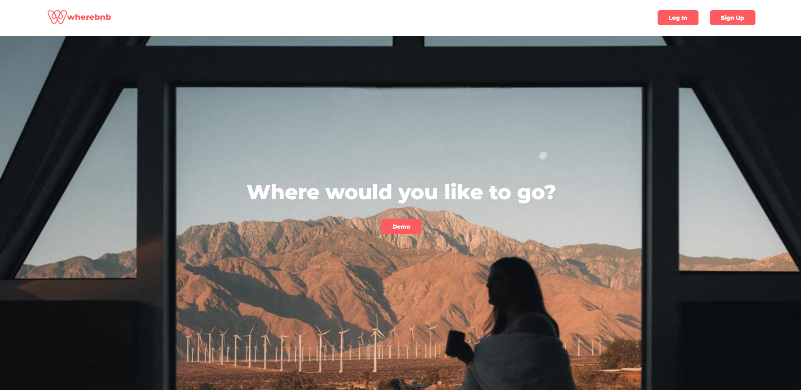
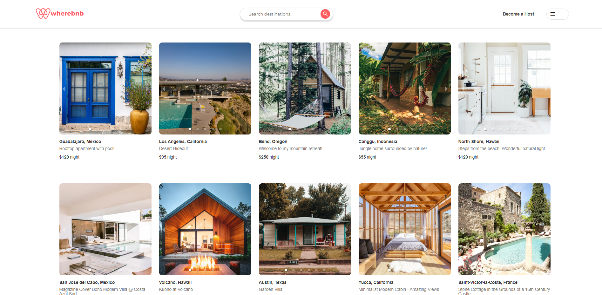
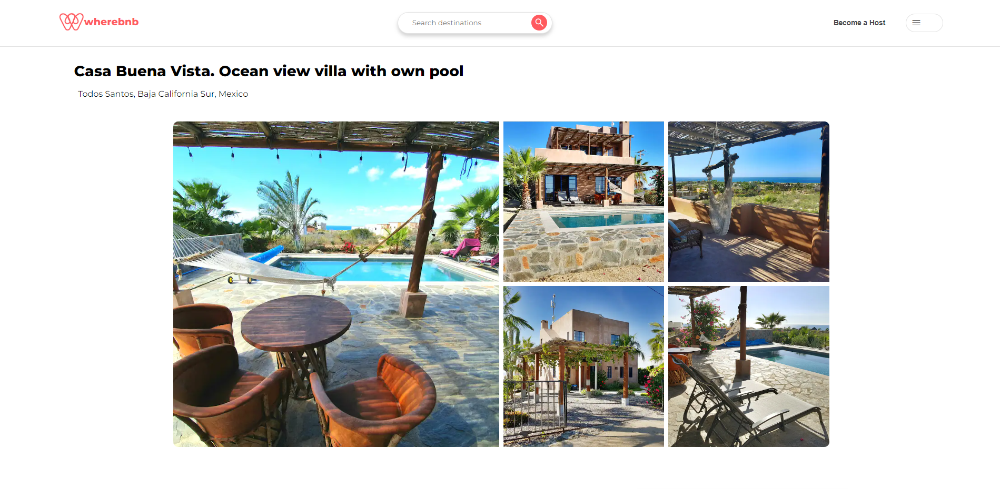
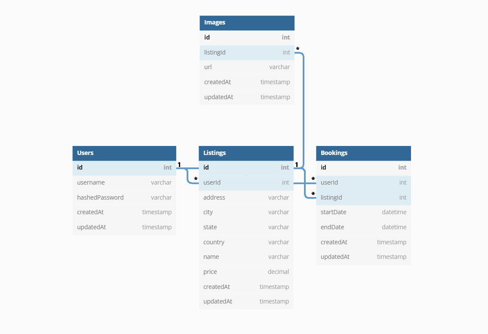

# Wherebnb

Check out Wherebnb here: [Wherebnb](https://wa-wherebnb.herokuapp.com/)

Wherebnb is a clone of Airbnb. The backend was built using PostgreSQL, Sequelize and Express. The front end was developed with React and Redux.  All styling was done without CSS libraries or frameworks.

## Landing Page

## Authentication
Wherbnb requires users to register and create an account before acecssing any of it's featurs. Upon successful login, users are directed to the homepage where they can begin looking through a portion of displayed listings.  Passwords are hashed using BcryptJS and stored in the database.  Any attempted navigation to other sections of the site, without authentication, will result in the user being redirected to the landing page.

## Home Page

## Features
Once authenticated, users are able to browse and search for listings.  Once a listing has been selected, Users are taken the details page of that specific listing.  Users have the option to select their desired dates and how many guests will joining them.  Upon succesful reservation, users are redirected to their 'bookings' page, where all of their bookings are displayed.  By selecting a booking, users can view the details of that specific booking or cancel the reservation entirely.

Users also have the ability to create and host a listing.  They are able to view all of their listings and edit them, or delete them, if they choose.

Users can search through all of the listings by the listing's location.  City, state/province, and country are accepted location criteria.

## Backend
The Listings and Bookings table are the most important models for wherebnb.  The Listings table stores the most amount of information, and is connected to all other tables through foreign keys.  Users have the ability to perform all CRUD on listings.

## ToDo's/Future Features

There are quite a few features that I would have liked to implement for this project. Airbnb is a very well designed site with a lot of features. Given the short window of time I had to complete the site, I would like to add the following features that are currently present on Airbnb:

- Location finding with Google Maps.
- Messaging between hosts and guests/potential guests.
- Better UX experience with more styling.
